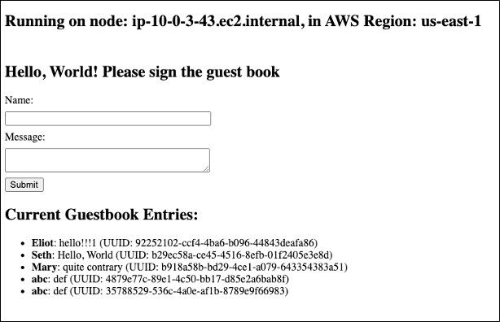

# XYZ Demo Application

This is the demo application repository used to demonstrate how to:
- Create a multi-environment CI/CD pipeline
- Build the app as a Docker image and push it to GitHub Container Registry
- Deploy the app to an Amazon Elastic Kubernetes Service (EKS) cluster.

This repository depends on the infrastructure deployed by the [xyz_infra_poc](https://github.com/setheliot/xyz_infra_poc) repository and pipeline.

Terraform backend state is stored in an S3 bucket with state locking enabled via a DynamoDB table. This setup ensures that multiple people can work with the pipeline and deploy simultaneously without causing conflicts by locking the state during operations like plan and apply.

Outputs from the infrastructure pipeline are read from the Terraform backend state generated by that repository. 

The deployment is currently configured to deploy to a staging environment first (from the `stage` branch) and then to a production environment (from the `main` branch). Other environments can be added.

| Environment type    | Short name | Branch     | Notes   |
| --------            | -------    |-------     | -------        |
| Production          | prod       | main       | Default branch |
| Staging             | stage      | stage      | The only source of pull requests into prod |
| Development         | dev        | (varies)   | Created by developers for pull requests into stage. They use their own AWS accounts as environments. |

## Application Design

This is a very simple application written in Python using the Flask framework to run a webserver that returns "Hello, World!" and the node name.

It is deployed with a desired replica count of 3 pods.

## CI/CD automation

The pipeline automation here currently only supports `stage` and `prod` environments.

The AWS Regions for the each of these should be different and match those of the infrastructure for the respective environments. You configure the Regions to use in [`stage.tfvars`](terraform/environment/stage.tfvars) and  [`main.tfvars`](terraform/environment/main.tfvars) respectively.

Developers create their own `dev` branches to work in (using their own accounts as environments) and then create pull requests from these into `stage`

Three GitHub actions workflows are defined:

- **Pipeline** ([`pipeline.yml`](.github/workflows/pipeline.yml)) does three things when a PR is merged into the `stage` branch for the `stage` environment, or into the `main` branch for the `prod` environment.
   1. Runs tests on the application
   2. Builds the application docker image and pushes it to the container registry
   3. Deploys the application from the docker image into the EKS (Kubernetes) cluster created  by the [xyz_infra_poc](https://github.com/setheliot/xyz_infra_poc) pipeline.
- **Enforce Flow** ([`enforce-flow.yml`](.github/workflows/enforce-flow.yml)) enforces the order in which changes flow through the environments in the pipeline. Currently with only the two environments, it enforces that `prod` will only accept merges from `stage`. It also checks that all tests in the previous environment have passed before accepting the merge.
- **Environment Tests** ([`ci.yml`](.github/workflows/ci.yml)) runs tests applicable to _every_ environment. The workflow currently runs unit tests on the application, but serves as a placeholder to add future tests. Note: **Stage Tests** and **Prod Tests** workflows can similarly be created for tests that only apply to a specific environment.

The following GitHub rules are enforced on branches `stage` (staging) and `main` (production)
- **Require approvals**: Requires at least one code review with resolution before merging.
- **Require a pull request before merging**: Require all commits be made to a non-target branch and submitted via a pull request before they can be merged.
- **Require status checks to pass**:
  - Checks **Enforce Flow** to ensure pull requests are only accepted from the designated previous environment in the pipeline, after all tests have passed on it.
  - Checks **Environment Tests** to ensure all environment tests pass on the  current environment.

The following [GitHub environments for deployment](https://docs.github.com/en/actions/managing-workflow-runs-and-deployments/managing-deployments/managing-environments-for-deployment) are defined: [`stage`](https://github.com/setheliot/xyz_app_poc/deployments/stage), [`prod`](https://github.com/setheliot/xyz_app_poc/deployments/prod) 

## How to use
1. Clone the repository.
1. Create an IAM User in the same AWS account used for the infrastructure that has the necessary credentials (see [below](#future-plans)). Enter `AWS_ACCESS_KEY_ID` and `AWS_SECRET_ACCESS_KEY` values for that IAM User in GitHub secrets (Settings ➡ Secrets and variables ➡ Actions ➡ New repository secret)
1. Generate a [GitHub Personal Access Token (PAT)](https://github.com/settings/tokens) with the following scopes:  `delete:packages`, `repo`, `write:packages`. Then enter this token into GitHub Secrets for the repo as `GHCR_TOKEN`. 
1. Update the `bucket` name, `dynamodb_table` name, and AWS `region` values in [`providers.tf`](terraform/providers.tf) under  _both_ the **Infrastructure remote backend** and **App Remote backend** settings to be the ***same*** as those used for the infrastructure pipeline.
1. [if necessary] Update [`stage.tfvars`](terraform/environment/stage.tfvars) and [`main.tfvars`](terraform/environment/main.tfvars) to set the `aws_region` to the _same__ used for the staging and production deployments of the infrastructure.
1. The staging environment app will automatically build and deploy to the staging infrastructure when you merge a pull request into branch `stage`.
1. The production environment app will automatically build and deploy to the production infrastructure when you merge a pull request from branch `stage` into branch `main`.

## Future plans
All of the [future plans for the infrastructure repo](https://github.com/setheliot/xyz_infra_poc?tab=readme-ov-file#future-plans) also apply here. Additionally:
- Provide a sample IAM Policy for AWS credentials required here that follows the principle of least-privilege
- Add a GitHub actions step to dynamically update this readme with the application url for all `stage` and `prod`.
- Add automation to check if the infrastructure pipeline successfully deployed the infrastructure
- Make the docker image private and enable Terraform to access it using the `kubernetes_secret` resource. In this case we would need pass in the GitHub Personal Access token and username from GitHub secrets using the `-var` argument on `terraform apply`.

